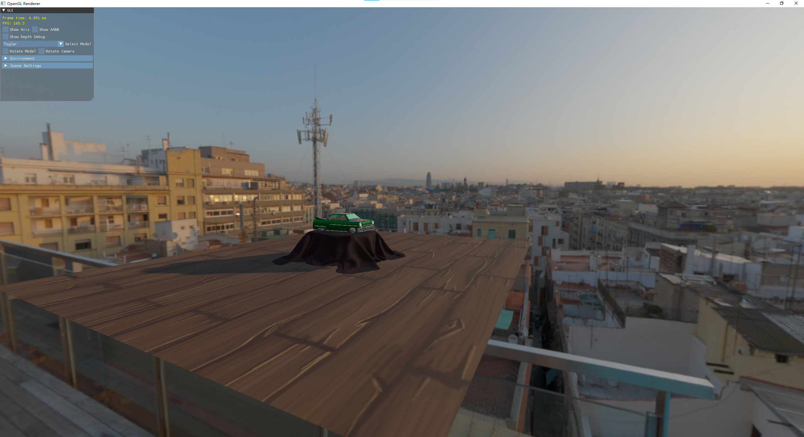
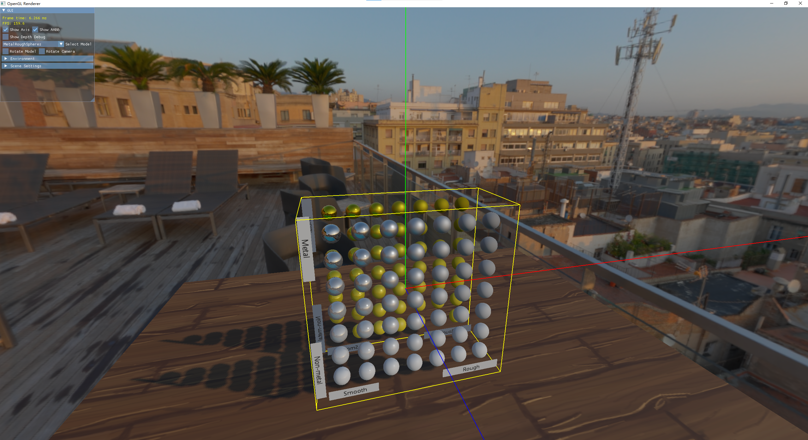
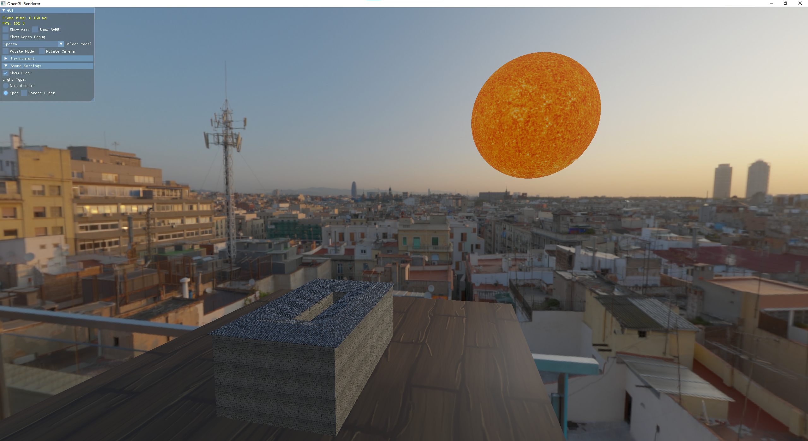

# EasyGraphics

## What's this?

This is a project made by myself while I am learning Computer Graphics. The theories of CG are really beautiful, but it's even more beautiful to implement them and see them. So I decided to build renderers using different Graphic APIs and implement rendering techniques. 

## Current Progress(2022.3.18 Milestone 0)

As a beginner for graphics programming, I chose the wrong starting point at the beginning. I started with Vulkan first and struggled with it for several months. I only managed to build a very basic renderer by following a tutorial, with a lot of Copy-and-Paste. The API is so verbose that I had to spend hours and hours trying to make it work. So at last I decided to fall back for a moment and picked up OpenGL and it turned out that my choice is not bad. After 2 months, I have managed to build a small renderer using OpenGL. 

Features:

* Forward rendering.
* HDR skybox.
* PBR(cook-torrance microfacet brdf).
* Loading gltf model(extensions not supported).
* Shadow Mapping(PCF filtering).
* Model Rotations.

Here are some screen shots:

## Future Plans

There's still a lot of rendering algorithms that I have not implemented, but I decided to migrate from OpenGL to **Vulkan**. Though OpenGL is far easier, I still touched some pain points, it is not modern. Different versions of functions in OpenGL mixed together and I found it quite annoying. With 2 months' experience in OpenGL, this time I feel more confident. I still foresee that I will encounter a lot of troubles when learning it, but this time we have ChatGPT ! I could learn faster with its help! I will spend another **2-3 months** and build a Vulkan renderer, here are the main steps:

1. Understand concepts and basic usage of Vulkan.
2. Build the wheel myself: Write a Vulkan wrapper(referencing other repos).
3. Build a simple forward renderer(like the OpenGL renderer).
4. Implement Raytracing.
5. Other advanced rendering algorithms...

## References
1. Hazel: https://github.com/TheCherno/Hazel
2. Shader Monthly: https://www.youtube.com/playlist?list=PL8vNj3osX2PzZ-cNSqhA8G6C1-Li5-Ck8
3. Learn OpenGL: https://github.com/JoeyDeVries/LearnOpenGL